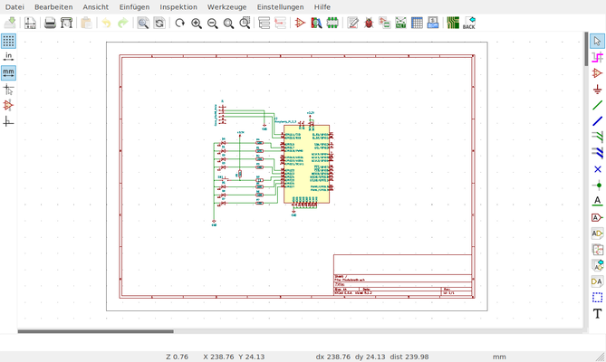
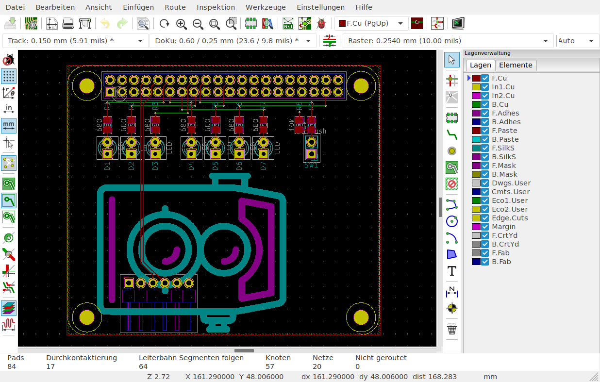

---
author: Tillo 
title: KiCAD x svg2shenzen
theme: solarized
...

## 'Bout me
- Tillo
- @morgulbrut
- Electronics Engineer
- Dev-board hoarder

## KiCAD
- EDA (Electronics Design Automation Suite)
- FOSS (mostly GPL)
- Bis vor einigen Jahren eher schlecht
- Jetzt: Entwickelt am CERN

## Workflow
- Schema zeichnen
- Schema annotieren  (in KiCAD: Footprints den Symbolen zuweisen) 
- Layout erstellen
- Daten erzeugen

## Schema zeichnen
- Symbole plazieren und Verbindungen zeichnen
- Ggf. Symbol und/oder Footprint erzeugen

## Schema zeichnen

## Demotime

## Make components
- Symbol
- Footprint

## Demotime

## Schema annotieren
* Komponenten nummerieren
* Schemasymbole mit Footprints verbinden

## Schema in das Layout übertragen
* Vor KiCAD 5 war es nötig im Schema eine Netzliste zu erstellen und diese dann im Layout zu laden.
* KiCAD 5 kann das jetzt automatisch.

## Demotime

## Make components
- Symbol
- Footprint

## Demotime

## Layout
* **Tipp:** Immer mit den Diff-Pairs beginnen
* **Tipp:** Auf einer Lage hauptsächlich horizontal und auf einer anderen hauptsächlich vertikal routen
* Ob und wie Vias tented werden ist wohl eine religiöse Frage.

## Layout

## Layerstack
- 2 layer: parts & routing & GND, routing & GND or VCC
- 4 layer: parts & routing(& GND), GND, VCC, GND & routing

## Route
- 45° Winkel, 90° nur falls nötig (Kreuzungen )
- Polygone benutzen
- .5 mm - .3 mm sind ätzbar im Lab
- Vias sind mühsam wenn man selber ätzt

## Generate gerber
- Checken ob alle benötigten Layer auch ausgeben werden
- Checkt die Gerber in einem Gerber

## Demotime

## SVG2Shenzen
* Ein Inkscape Plugin für PCB art.
* Layer "_disable" schaltet die betreffenden Layer aus.
* Was in KiCAD übernommen werden soll, muss "dunkel" sein.
* Gemacht von Budi aus Indonesien
* @manticore_ auf twitter
* badgeek auf github

## Demotime

## kitspace.org
* Sharing is caring
* Gerber und BOM können hochgeladen werden
* Github pullrequests und so
* Gemacht von Kaspar Immanuel
* kasbah auf github

## Demotime

## Links
[KiCAD getting started](http://docs.kicad-pcb.org/5.1.2/en/getting_started_in_kicad/getting_started_in_kicad.html)