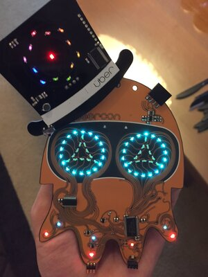
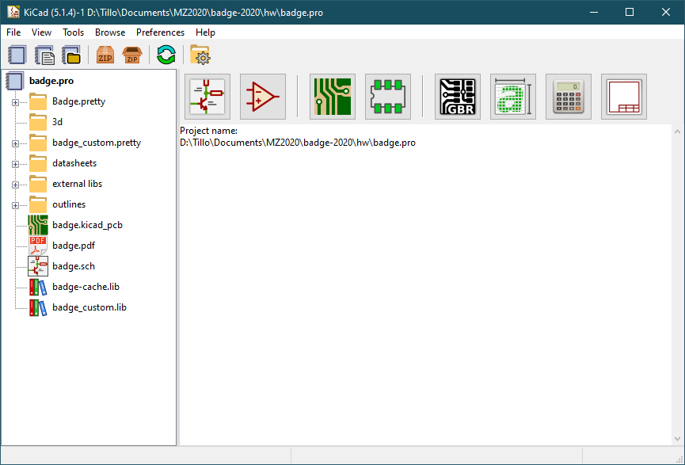

## 'Bout me
- Tillo
- @morgulbrut on the twitters
- Electronics Engineer by day
- Dev-board hoarder by night

## PCB art
- done a long time by various folks
- boomed in recent years as #badgelife
- badges for hacker cons

## Micronoise by SGMK

## Viking Badge by Thomas Flummer

## Jogjarmageddon by dusjagr 

## Queercon badge 2016

## Shitty Add-On
- addon for badges, originally for DEF CON
- easy entry to PCB art
- MZ badge will have some connectors too

## Some Shitty Add-Ons

## SAO 1.69bis specs
- 3V3 and GND
- I²C
- Two GPIO
- Max power 1.1 millihorsepower (250mA @ 3.3V)
- Serial Port on one of the badge

## Tools we will use
- Inkscape
- svg2shenzen
- KiCad

## Inkscape
- Vectorgraphics editor
- FOSS 

## SVG2Shenzen
- An inkscape plugin for PCB art.
- Layer "_disable" disables that Layer.
- The stuff you want to have in your design needs to be "dark".
- made by Budi from Indonesia 
- @manticore_ on the twitters
- badgeek on github

## KiCad

## KiCad
- EDA (Electronics Design Automation Suite)
- FOSS (mostly GPL)
- Used to be pretty bad in the past
- Now: developed at CERN

## EDA workflow
- Draw schematics 
- Annotate schematics (in KiCAD also: assign footprints to symbol) 
- Layout 
- Generate data 

## Schematics editor

## Draw schematics
- Place symbols and connect them.
- Make new components if needed.

## Make components
- Symbol
- Footprint
- Add 3d model(s) to a footprint (if wanted)

## Annotate schematics
- Automatically number the components.
- Manually assign footprints to symbols.

## Schematic to layout
- Before KiCAD 5 it was needed to generate a netlist and load it into the layout.
- KiCAS 5 can do it in one step.

## Layout editor

## Layout
- **Tip:** Always start with diff pairs.
- **Tip:** Route mainly horizontal on one layer and mainly vertical on another.
- Tented vias: Some say do it, some say don't. I don't really know.

## Layerstack
- 2 layer: parts & routing & GND, routing & GND or VCC
- 4 layer: parts & routing(& GND), GND, VCC, GND & routing

## Route
- 45° angles, 90° only if really needed (T-joints and the like)
- make polygons if possible
- .5 mm - .3 mm are etchable in your homelab
- vias are a pain if you etch the prints yourself

## Generate gerber
- Check if every layer you need is in the output.
- Check the gerbers after generating them.

## kitspace.org
- Sharing is caring
- Upload gerbers and BOM
- Connects to github
- Made by Kaspar
- kasbah on github

---------

### github.com/morgulbrut/kicadWorkshop

Branch: SAO-Workshop 