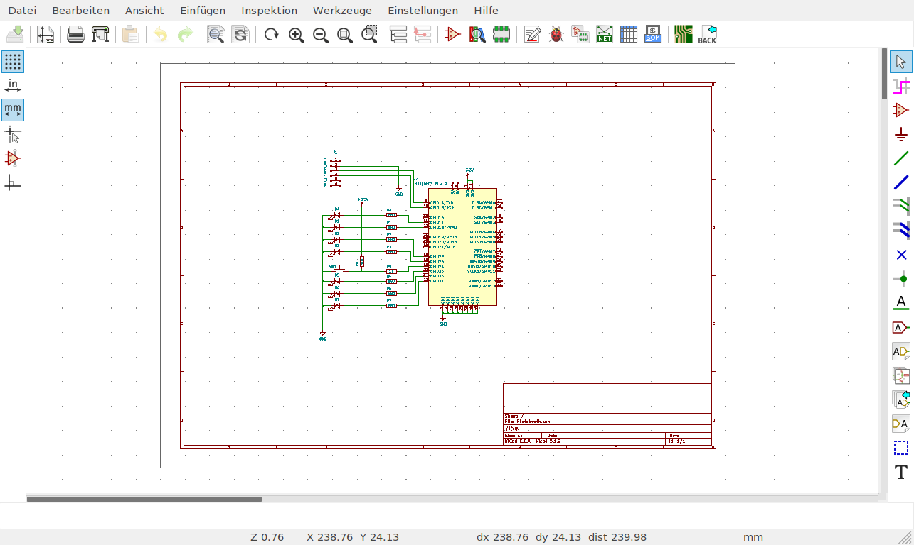

## 'Bout me
- Tillo
- @morgulbrut on the twitters
- Electronics Engineer by day
- Dev-board hoarder by night

## SAO
- addon for badges, originally for DEF CON
- easy entry to PCB art
- MZ badge will have some

## SAO Spec
- 3V3 and GND
- I²C
- Two GPIO
- Max power 1.1 millihorsepower (250mA @ 3.3V)
- Serial Port on one of the badge

## KiCAD

## KiCAD
- EDA (Electronics Design Automation Suite)
- FOSS (mostly GPL)
- Used to be pretty bad in the past
- Now: developed at CERN

## General workflow
- Draw schematics 
- Annotate schematics (in KiCAD also: assign footprints to symbol) 
- Layout 
- Generate data 

## Draw schematics
- Place symbols and connect them.
- Make new components if needed.

## Draw schematics

## Make components
- Symbol
- Footprint
- Add 3d model(s) to a footprint (if wanted)

## Annotate schematics
- Automatically number the components.
- Manually assign footprints to symbols.

## Schematic to layout
- Before KiCAD 5 it was needed to generate a netlist and load it into the layout.
- KiCAS 5 can do it in one step.

## Layout
- **Tip:** Always start with diff pairs.
- **Tip:** Route mainly horizontal on one layer and mainly vertical on another.
- Tented vias: Some say do it, some say don't. I don't really know.

## Layout

## Layerstack
- 2 layer: parts & routing & GND, routing & GND or VCC
- 4 layer: parts & routing(& GND), GND, VCC, GND & routing

## Route
- 45° angles, 90° only if really needed (T-joints and the like)
- make polygons if possible
- .5 mm - .3 mm are etchable in your homelab
- vias are a pain if you etch the prints yourself

## Generate gerber
- Check if every layer you need is in the output.
- Check the gerbers after generating them.

## SVG2Shenzen
* An inkscape plugin for PCB art.
* Layer "_disable" disables that Layer.
* The stuff you want to have in your design needs to be "dark".
* made by Budi from Indonesia 
* @manticore_ on the twitters
* badgeek on github

## kitspace.org
* Sharing is caring
* Upload gerbers and BOM
* Connects to github
* Made by Kaspar
* kasbah on github

## Hack all the things

## Links
- [KiCAD getting started](http://docs.kicad-pcb.org/5.1.2/en/getting_started_in_kicad/getting_started_in_kicad.html)
- [shitty add on](https://hackaday.com/2019/03/20/introducing-the-shitty-add-on-v1-69bis-standard/)
- [svg2shenzhen](https://github.com/badgeek/svg2shenzhen)
- [badgelive parts KiCAD libs](https://github.com/devec0/badgelife-parts)