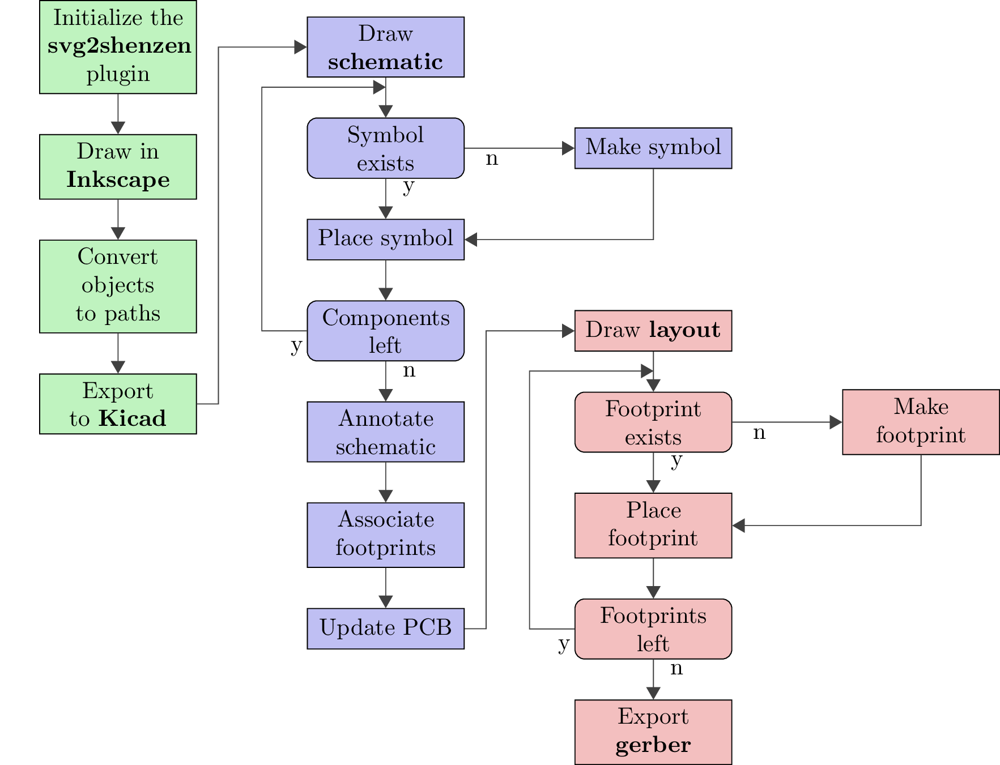

# Shitty add-on


# Prerequisites

We gonna use KiCAD 5, since there are tons of improvements. 

## KiCad and Inkscape

**Disclaimer:** I use Arch BTW. Well and I know how to install it on windows.

I use **KiCad 5.1** and **Inkscape 0.92.4**

### Windows

Go to [http://www.kicad-pcb.org](http://www.kicad-pcb.org) and grab the installer, the standard libraries comes with it and is pretty powerful.

Go to [https://inkscape.org/release/0.92.4/platforms](https://inkscape.org/release/0.92.4/platforms) and grab the installer. 

### Linux

1. Search  for it in the repos.
2. Grab also libraries, if it's a separate package.

or if not in your package system: see **Windows**

### Mac

See **Windows** 

## svg2shenzen

An Inkscape plugin we use for PCB art, get it from [https://github.com/badgeek/svg2shenzhen](https://github.com/badgeek/svg2shenzhen) and install it as described there.

### Linux:

- be sure to have lxml for python2 installed.
- be sure to set the exec bits correctly. [https://github.com/badgeek/svg2shenzhen/issues/52](https://github.com/badgeek/svg2shenzhen/issues/52)

## Shitty Add-On library

Get it from [https://hackaday.io/project/52950/files](https://hackaday.io/project/52950/files)

## Simple SVG

Since the time is limited, you profit more, if you already bring a simple SVG. See  for some

### Installation

Since Kicads Library management is a bit quirky I usually just put the used external libraries into a folder inside my project folder. Works always.

\pagebreak

# Workflow



That's roughly the workflow I use. You maybe found one which suits you better.

## svg2shenzen & Inkscape

1. Initalize a new drawing using \menu{Extensions > Svg2Shenzhen > Prepare Document...}
2. Draw your thing. 
   1. Keep in mind, there are some layer combinations that make no sense.
   2. If the layers has the suffix *disabled* it is disabled. Rename it from *<X>-disabled* to *<X>*.
   3. Check if the layers are dark enough.
3. Convert objects to paths.
4. Export to KiCad.
   1. Check \menu{Open Kicad after export?}.
   2. Uncheck \menu{Open PCBWay after export?}.
   
## KiCad

### Draw schematics
- Place components using 

### Make components
- Symbol
- Footprint
- Add 3d model(s) to a footprint (if wanted)

### Annotate schematics
- Automatically number the components.
- Manually assign footprints to symbols.

### Schematic to layout
- Before KiCAD 5 it was needed to generate a netlist and load it into the layout.
- KiCAS 5 can do it in one step, by pressing \keys{F8}

### Layerstack
- 2 layer: parts & routing & GND, routing & GND or VCC
- 4 layer: parts & routing(& GND), GND, VCC, GND & routing

### Layout
- **Tip:** Always start with diff pairs.
- **Tip:** Route mainly horizontal on one layer and mainly vertical on another.
- Tented vias: Some say do it, some say don't. I don't really know.

### Route
- 45° angles, 90° only if really needed (T-joints and the like)
- make polygons if possible
- .5 mm - .3 mm are etchable in your homelab
- vias are a pain if you etch the prints yourself

### Generate gerber
- Check if every layer you need is in the output.
- Check the gerbers after generating them.

## Libraries 

Libraries can be installed globally or for a project. If you want to share your project your mostly better off putting them into a subdirectory of your project, and then install it for that project.

```
your_kickass_project
├── external_libs
|    ├── lib1
|    |    ├── lib1.pretty
|    |    └── lib1.lib
|    └── lib2
|         ├── lib2.pretty
|         └── lib2.lib
├── your_kickass_project.kicad_pcb
├── your_kickass_project.pro
└── your_kickass_project.sch
    
```

# Shortcuts 

Some handy shortcuts I found out there on the Web.

| Key               | Schematic editor         | PCB Editor                     |
|:------------------|:-------------------------|:-------------------------------|
| \keys[/]{+}       |                          | **Switch to Next Layer**       |
| \keys{-}          |                          | **Switch to Previous Layer**   |
| \keys{/}          | Add Bus Entry            | Switch Track Posture           |
| \keys{?}          | Help                     |                                |
| \keys{A}          | **Add Component**        |                                |
| \keys{B}          | Begin Bus                | **Redraw polygons**            |
| \keys{\backspace} |                          | Delete Track Segment           |
| \keys{C}          | Copy Component or Label  | Copy Item                      |
| \keys{\ctrl+F}    |                          | Find Item                      |
| \keys{\ctrl+L}    |                          | Load Board                     |
| \keys{\ctrl+S}    |                          | Save Board                     |
| \keys{\ctrl+V}    |                          | Add Microvia                   |
| \keys{\ctrl+W}    |                          | Switch Track Width to Previous |
| \keys{\ctrl+Y}    |                          | Redo                           |
| \keys{\ctrl+Z}    |                          | Undo                           |
| \keys{D}          |                          | Drag Track, Keep Slope         |
| \keys{\del}       | **Delete Item**          | Delete Item                    |
| \keys{E}          | **Edit Item**            | Edit Item                      |
| \keys{End}        |                          | End Track                      |
| \keys{F}          | Edit Footprint           | Flip Item                      |
| \keys{F1}         | Zoom In                  |                                |
| \keys{F2}         | Zoom Out                 |                                |
| \keys{F3}         | Zoom Redraw              |                                |
| \keys{F4}         | Zoom Center              |                                |
| \keys{F5}         |                          | Switch to Inner Layer 1        |
| \keys{F6}         |                          | Switch to Inner Layer 2        |
| \keys{F8}         | **Schematic to Layout**  |                                |
| \keys{G}          | **Drag Item**            | **Drag Item**                  |
| \keys{H}          | Add Hierarchical Label   | Switch Highcontrast Mode       |
| \keys{Home}       | Fit on Screen            |                                |
| \keys{Insert}     | Repeat Lest Item         |                                |
| \keys{J}          | Add Junction             |                                |
| \keys{K}          | End Line Wire Bus        | Track Display Mode             |
| \keys{L}          | Add Label                | Lock/Unlock Footprint          |
| \keys{M}          | **Move Item**            | **Move Item**                  |
| \keys{N}          | Orient Normal Component  |                                |
| \keys{O}          |                          | Add Module                     |
| \keys{P}          | **Add Power**            | **Place Item**                 |
| \keys{PgDn}       |                          | Switch to Cooper Layer         |
| \keys{PgUp}       |                          | Switch to Component Layer      |
| \keys{Q}          | Add No Connect Flag      |                                |
| \keys{R}          | **Rotate Item**          | **Rotate Item**                |
| \keys{S}          | Add Sheet                |                                |
| \keys{\Space}     |                          | Reset Local Coordinates        |
| \keys{T}          |                          | Get and Move Footprint         |
| \keys{\tab}       | Move Block -> Drag Block |                                |
| \keys{U}          | Edit Reference           |                                |
| \keys{V}          | Edit Value               | **Add Via**                    |
| \keys{W}          | **Begin Wire**           | Switch Track Width to Next     |
| \keys{X}          | **Mirror X Component**   | **Add New Track**              |
| \keys{Y}          | **Mirror Y Component**   |                                |
| \keys{Z}          | Add Wire Entry           |                                |
| \keys{\Alt+3}     |                          | **3D Viewer**                  |

# Links
- [KiCAD getting started](http://docs.kicad-pcb.org/5.1.2/en/getting_started_in_kicad/getting_started_in_kicad.html)
- [shitty add on](https://hackaday.com/2019/03/20/introducing-the-shitty-add-on-v1-69bis-standard/)
- [svg2shenzhen](https://github.com/badgeek/svg2shenzhen)
- [badgelive parts KiCAD libs](https://hackaday.io/project/52950/files)
- [KiCad shortcuts](https://shortcutworld.com/KiCAD/win/KiCAD_Shortcuts)